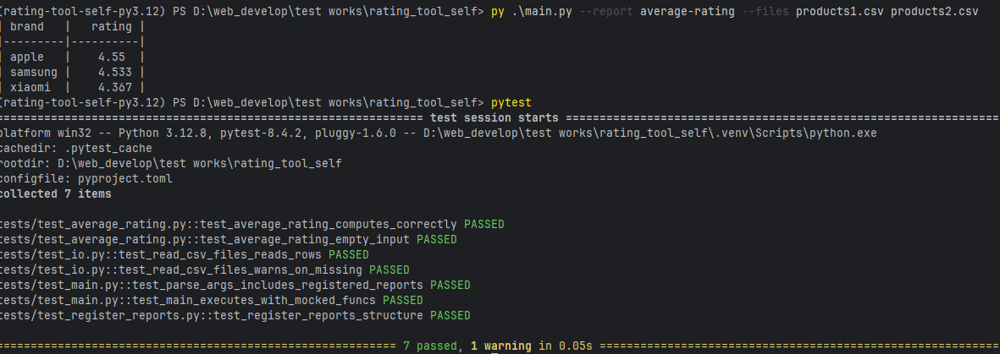

# Посмотреть зарегистрированные отчеты
```poetry run py .\main.py --help```
# Запуск скрипта
1. Установка зависимостей 
```poetry install```
2. Запуск скрипта
```poetry run py .\main.py --report average-rating --files file_name_1 file_name_2```
3. Запуск тестов 
```
poetry run pytest
```
# Регистрация отчетов - script/register_reports.py


